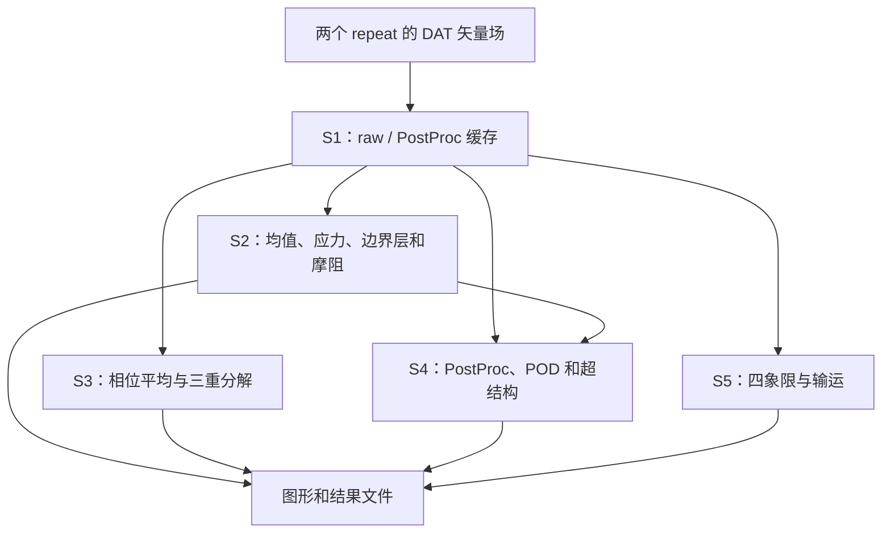

# 当前 Code Intelligence 基准

源码基准：c860e5d2e259561147f70e0e932e0b6300bc512e。
仓库：[Fr4nkMut5um1/AFC-Data-Processing](https://github.com/Fr4nkMut5um1/AFC-Data-Processing)，当前为 Public。

Git 根目录对应源码包中的 project/；当前两个入口位于 cases/per_case/tandem_baseline_r2/ 和 cases/per_case/tandem_f40a3_phi0_r2/。完整 Git 历史 bundle 未上传，见 [IMPORT_PROVENANCE.md](../IMPORT_PROVENANCE.md)。

## 人可读的初步架构

以下为 INFERRED：

参数消费者、wrapper 层、第三方边界和架构问题见 [P0_RECONNAISSANCE.md](P0_RECONNAISSANCE.md)。

## P1 原生静态结果

GitHub-hosted ubuntu-22.04 上 MATLAB R2022b Update 10 已成功运行。两个 case 各分析 135 个文件、失败 0 个、source_unchanged=1；native required products 均只返回 MATLAB。完整输出在 Actions artifact matlab-r2022b-native-static-ground-truth 中。

P1 状态：NATIVE_STATIC_COMPLETE_WITH_LIMITATIONS。

当前 .github/workflows/matlab-cloud-r2022b.yml 和 matlab-static-r2022b.yml 对 main 的 cases/**、lib/**、code-intelligence/** 或 workflow 文件变化自动运行，并保留手动触发。

## 未完成阶段

P2 runtime、P3 schema normalization、P4 Archify、P5 Cognition DeepWiki 和 P6 完整闭环尚未实施。仓库没有代表性 PIV 输入数据，不能把完整 runtime 验证写成已完成。

当前状态详见 [P0_P1_FINAL_STATUS.md](P0_P1_FINAL_STATUS.md)。

## Current update (P2-P6)

- P2 bounded runtime smoke is COMPLETE_WITH_LIMITATIONS. Run 34688222305 passed the cache statistics core, phase statistics, and structure recognition synthetic tests under GitHub-hosted ubuntu-22.04 with MATLAB R2022b Update 10. Evidence and profile records are in the matlab-r2022b-runtime-smoke artifact.
- P2 representative runtime remains BLOCKED: both case input directories contain only README files. A negative probe also recorded that tblR2.io.load_tecplot_dat calls memory, which is unsupported on the Linux runner; temporal_spectra_cache requires pwelch from the unavailable Signal Processing Toolbox.
- P3 evidence schema is documented in evidence/EVIDENCE_SCHEMA.md.
- P4 Archify handoff facts are prepared in archify/, but this environment has no Archify renderer or connector; status is BLOCKED_EXTERNAL_RENDERER.
- P5 DeepWiki integration is BLOCKED_NO_DEEPWIKI_CONNECTOR; no index or runtime claim is fabricated.
- P6 is partial: main path changes automatically trigger cloud smoke, static, and runtime smoke workflows; dynamic evidence stays in Actions artifacts and is not automatically committed as source.
