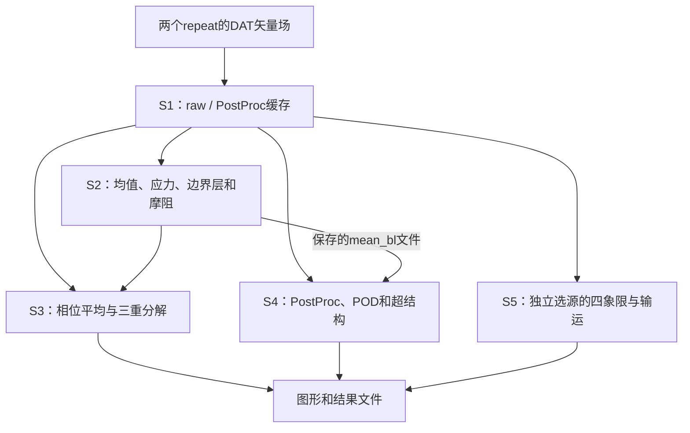

# 当前 Code Intelligence 基准

当前源码：`c860e5d2e259561147f70e0e932e0b6300bc512e`。
仓库：`Fr4nkMut5um1/AFC-Data-Processing`，已确认 private 和读写权限。

## 路径和版本

Git 根目录对应新 ZIP 内的 `project/`。保持原 Git 目录拓扑，case 路径如下：

| 角色 | 当前入口 |
|---|---|
| 基准 B | cases/per_case/tandem_baseline_r2/tandem_baseline_r2_case.m |
| 受控 C | cases/per_case/tandem_f40a3_phi0_r2/tandem_f40a3_phi0_r2_case.m |
| 原 P0 报告中的 cases/<case>/… | 当前 cases/per_case/<case>/… |

已对比旧观察层的422项case文件：416项字节相同，4项README/参数指南更新，
2项output/README.md未收入新包。原先覆盖的402个MATLAB文件全部字节相同。
当前两个case共420文件，本轮导入和路径适配未修改科学文件。
新包manifest的845项文件哈希已核对通过；bundle HEAD与版本声明一致。

GitHub以新导入提交保存源码快照；原始提交历史保留在原交付包的bundle中；本次未将该归档加入GitHub。
两者身份区别见 [IMPORT_PROVENANCE](../IMPORT_PROVENANCE.md)。

## 初步架构与证据

以下为 **INFERRED**，不是MATLAB执行记录。

详细计算链、参数消费者、第三方边界、架构问题与云端调查保留在
[历史P0报告](P0_RECONNAISSANCE.md)。上述402个MATLAB文件未变，相关源码关系仍可参考；
该报告描述的旧包路径、GitHub身份、文件数和接入状态以本页为准。
当前源码中其他集中维护副本和历史入口仍存在，不能因case独立即把整仓库视为仅两个case。

## 本次适配和验证

- Python双进程启动器、MATLAB命令示例和未激活Actions模板已改用 `cases/per_case/`。
- 每case重建源码索引，分别210文件、866/868个文本引用；仍仅为INFERRED。
- 当前420文件保护记录见 `evidence/protection_check_c860e5d.json`。
- Python可解析，缺失MATLAB和case内部输出目录的启动前拒绝路径通过；不代替MATLAB测试。
- Actions模板仍是 `.yml.example`，不自动触发、不自动发布实验数据。

P1状态：**COLLECTOR_PREPARED_NATIVE_NOT_RUN**。
目前没有MATLAB原生依赖边、运行调用或新的科学验收。
仓库接入已经解决；私有GitHub-hosted MATLAB仍须合法许可。
可在已安装合法MATLAB的机器运行同一采集器，云端路线继续按官方许可条件推进。

P2–P6尚未实施。云端DeepWiki默认Cognition官方；未来本地默认DeepWiki-Open。
