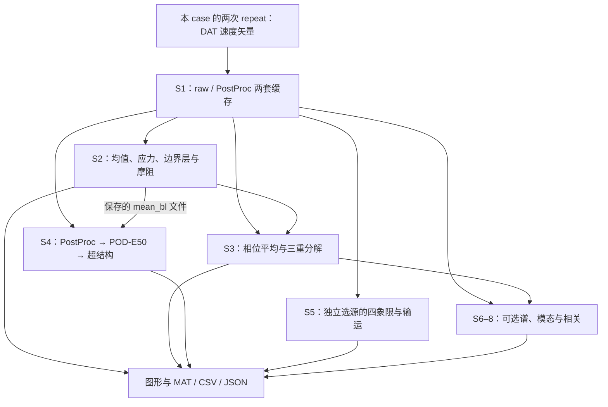

> 历史记录：本文描述较早交付快照；当前基准、仓库接入及新增验证见 [CURRENT_BASELINE.md](CURRENT_BASELINE.md)。

# AFC-Data-Processing：P0 侦察、P1 静态采集准备与云端 MATLAB 可行性

核查日期：2026-09-10。任务：PIV Code Intelligence System 第一轮。范围仅 P0、P1 与 Cloud MATLAB feasibility；没有推进 P2–P6，也没有修改科学代码。

## 1. 结论与真实完成状态

**已经建立一套可审查、可重跑的观察层，但尚未取得本版本的 MATLAB 原生 STATIC 证据，P1 不能宣布验收完成。**

已完成：定位最新可获得交付包；阅读交接要求、保护边界、样本说明、审查报告与当前实现；确定真实入口和主要计算链；生成两个 case 的完整文件哈希与源码引用索引；编写 MATLAB 原生静态采集器；提供未激活的手动 Actions PoC；核查许可、Toolbox、资源和样本条件。

未完成：当前云环境没有可调用 MATLAB；GitHub 仓库读取未成功，无法核实远端可见性、HEAD、Actions 设置或运行权限；未启动任何 GitHub job。没有新的 profiler、数值验收、原生静态图或运行日志。

| 项目 | 本轮状态 |
|---|---|
| 本地源码侦察与架构说明 | 已完成，关系标为 INFERRED |
| 本地字节与文件存在性核查 | 已执行；属于文件观察，不能升级为 MATLAB STATIC |
| MATLAB 采集器实现 | 已编写、人工审阅；未在 MATLAB 中执行 |
| MATLAB 原生依赖与最小 Toolbox 验证 | NOT_RUN |
| GitHub-hosted MATLAB | 官方能力支持；项目实跑未验证 |
| P2 runtime / Archify / DeepWiki / 持续更新 | 未实施 |

本报告中的 P0/P1 指 Code Intelligence 阶段；旧包中的 P0–P5 指上一轮科学代码架构简化，两套阶段编号不可混淆。

## 2. 当前分析对象与版本

本轮最初附件只有任务 Markdown。查得 2026-09-10 最新交付包 **PIV_r2_P0_P5.zip**，以其中 `cases/` 为当前可获得代码快照，`comparison/project_original/` 为重构前历史对照。没有新建独立产品项目；`code-intelligence/` 放在同一快照根目录。

| 身份项 | 实际核查结果 |
|---|---|
| ZIP 大小 | 196,525,643 bytes |
| ZIP SHA-256 | `49397fc28f5877b0ff8f029d16d7356d04a0788fdd1886bab3d12752b5133fe2` |
| bundle HEAD | `37bcfe0f792dfcf99d489e482a80405f90de72fa`，包内 `changes/P0_P5_history.bundle` 的 `master`/HEAD |
| 远端 GitHub 线索 | 历史检索返回 `LeoTheBest/AFC-Data-Processing`、main、83b8b65；没有成功取得远端源码，不能作为当前基准 |
| GitHub 请求 | 首次搜索受到服务端限制；继续核查后，当前已连接身份确认为 Angelica-Lin，可访问仓库列表及 AFC-Data-Processing 安装仓库搜索均为空；该账号同名仓库 GET 返回404。不能据此判断实际项目的归属、可见性或是否存在 |
| 当前目录 | 解压快照，没有活动 `.git`；bundle 是历史记录，不证明远端同步 |
| 当前 case | `cases/tandem_baseline_r2`、`cases/tandem_f40a3_phi0_r2` |
| 每 case 文件数 | 211；其中 lib 有 182 个 `.m`，third_party 有 4 个 `.m` |
| 两 case 的 lib | 逐文件字节一致；它们仍是两份独立本地副本 |
| 编译依赖 | 当前两个 case 未发现 `.mexw64` / `.mexa64` / `.dll` / `.so` / `.p` 文件；不代表未来外部模块没有二进制依赖 |
| 原生 MATLAB Project 文件 | 本快照未发现 `.prj`；ChatGPT Project 与 MATLAB Project 不是同一个概念 |

没有把历史检索中的 `unified_preprocess.m`、`run_batch_pipeline.m` 当作已证实入口：本次磁盘源码明确显示的是下面两个 `*_r2_case.m`。也没有把历史“验收通过”线索覆盖包内明确的动态未验收状态。

继续执行时还检查了原生执行条件：未找到 MATLAB、matlab-batch、MPM、Docker 或 gh；三个常用 MATLAB 许可环境变量均未配置（只检查存在性，没有读取或记录值）；没有可安装的 MATLAB 连接器搜索结果。这些只说明本次环境不可直接执行，不是 MATLAB 云端方案整体不可行。具体记录见 `evidence/execution_access.json`。

阅读顺序：当前根 README、VALIDATION_RECORD；comparison/START_HERE；handoff 全部六份 Markdown；两 case 使用与验收说明；当前两个主脚本的 Section、分支和相互差异；S1/S2/S3/S4/S5 主要实际调用及第三方寻址；旧 review、work instructions 和旧 architecture 对照。`03_source_evidence.md` 是历史摘录索引，不用它替代当前源码；未逐文件人工审计全部科学算法。

## 3. 先看人能理解的架构

以下箭头都是 **INFERRED：基于源码阅读的依赖/数据流**，不是 MATLAB 实际运行记录。图中省略结果身份检查、文件发布等辅助动作；它们在后表中保留。

这里输入已经是 DAT 矢量场。没有源码依据把“相机标定、原始图像互相关求矢量”插入这张地图；raw/PostProc 是现成数据源，不代表本程序已经包含生成 PostProc 的全部上游处理。

最容易误解的两点：S4 从保存的 mean_bl 读取壁距/u_tau，但自己计算 PostProc 均值、POD 和检测 RMS；S5 自行生成同源统计，不拿 S2/S3 结果替代。因此不能把各 Section 画成一条每次都必须从头跑完的直线。

## 4. 真正入口与默认行为

下文 **B** 指 `cases/tandem_baseline_r2/tandem_baseline_r2_case.m`；**C** 指 `cases/tandem_f40a3_phi0_r2/tandem_f40a3_phi0_r2_case.m`。**T/**、**D/** 分别指本 case 的 `lib/+tblR2/`、`lib/+d23/`。L 是当前文件物理行号。

| 入口 | 职责 | 当前默认 |
|---|---|---|
| B | 基准工况的日常脚本；1072 行 | cache/statistics/mean_bl=reuse；phase=skip；structures=compute；transport=skip；figures=skip |
| C | 40 Hz 受控工况的日常脚本；1084 行 | cache/statistics/mean_bl/phase=reuse；structures=compute；transport=skip；figures=compute |
| `maintenance/checks/` | 各种脚本、函数和单元测试；不是统一的 runtests 接口 | 本轮不执行 |
| `run_review_smoke_for_case` | 明确 case/fixture/报告路径的小样本入口 | 只覆盖指定核心，不代表完整主流程 |

B 的真实 Section 开始行：0=1、1=390、2=431、3=549、4=619、5=669、6=694、7=760、8=876、9=951。C 的对应行号见生成索引。

Section 0 的源码已把 case 本地 lib 放入 path，参数集中在主脚本；执行 `validate_config`、`build_paths`、`workspace_results`（B L381–384）。这次没有执行编辑器，因而不能将“存在 %%”写成 Run Section 已验收。

默认 S4 仍为 compute。**本轮采集绝不调用完整主脚本**，也不靠把默认值改为 skip 来获得“安全运行”的假象。

## 5. 主要依赖：实际计算与辅助层

全部关系为 INFERRED；表中给出源码定位以便人工追踪。

| 任务 | 当前调用路径 / 关键输入 | 源码证据 |
|---|---|---|
| 数据读取与缓存 | 主脚本 → prepare_sequence_cache → singlecase.dat_manifest / io.load_tecplot_dat → 分块 MAT；raw 与 PostProc 分别处理 | B L420、423、426；T/prepare_sequence_cache.m L142–201 |
| 均值、波动矩 | mean_stats_cache，输入选定缓存与帧范围 | B L449–505；函数位于 T/mean_stats_cache.m |
| 边界层与摩阻 | mean_bl_friction → wall_distance_grid / extract_velocity_profile / loglaw_fit_chen / composite_profile_fit_rodriguez_lopez / integral_params / wall.* | B L523；T/mean_bl_friction.m L20–71、132–157 |
| 相位平均 | phase_stats_cache(raw, cfg, statistics)；受控预览满足条件时另算 PostProc phase_contour | B L589；C L583–584、609–615 |
| S3 绘图 | 主脚本直接交给 plot_section3_preview，绘制体已外移 | B L608；C L623 |
| S4 适配/编排 | section4_vlsm_analysis(postproc, cfg, mean_bl_file, output_file) → validate / prepare_source / select_section4_run | B L664；T/section4_vlsm_analysis.m L1、27–42 |
| S4 实质计算 | d23.compute_statistics → finalize_context → build_pod_cache → prepare_detection_statistics → run_detection | T/section4_vlsm_analysis.m L78–87；D/identify_frame.m L19–24 是连通域与属性测量 |
| S4 导出 | section4_vlsm_figures、write_outputs、结果适配及发布 | T/section4_vlsm_analysis.m L153–165、939–968 |
| S5 编排 | section5_run：选缓存、验身份、compute/reuse、原子保存、绘图 | B L687；T/section5_run.m L33–80 |
| S5 实质计算 | transport_analysis → transport_statistics / gradient_y_sensitivity / quadrant_streaming | T/transport_analysis.m L5、13、25、51 |
| 可选扩展 | temporal_spectra_cache、spatial_spectra_cache、pod_module、dmd_module、lcs_ftle、spod_cache、correlation_analysis_cache、streamwise_development_analysis | B L733、750、811、824、855、868、914、942 |
| 通用绘图 | plot_products → 局部 delegate → plot_core_products → 实际 render 函数 | T/plot_products.m L43、55–56 |
| 路径与结果身份 | require_case_library、workspace_results、save/load_result、result_inputs、result_parameters | 主脚本各 Section 边界；这是保护/复用层，不应绘成新的科学算法 |

`d23.run_experiment` 是另一条编排入口；当前 S4 适配器直接调用其底层任务，不调用它。`pod_denoise_prepare_memory_friendly` 也不能凭名字被认作当前 S4 的 POD 入口。保留的研究函数不能因为日常脚本未调用，就判为全项目废弃。

文件依赖与函数依赖应分开：同文件内的 delegate/render/局部 helper 不会天然成为 `requiredFilesAndProducts` 的独立节点。P1 采集的文件图不能冒充完整局部函数图。

## 6. 参数在哪里真正生效

已有两份 PARAMETER_MAP.csv 可帮助导航，当前判断仍以赋值及消费者源码为准。本轮只给已追踪的代表性链，不宣称完成所有字段的数据流分析。

| 想改什么 | 当前入口，以 B 为例 | 实际消费者 / 影响 |
|---|---|---|
| 数据源/repeat 顺序 | B L87–100，显式 input 路径；3rd→2nd，offset=[0 0] | prepare_sequence_cache L142–201；不能改成自然升序 |
| S2 数据源与帧段 | statistics_source / statistics_frame_mode；B L449–501 选择与映射 | mean_stats_cache；不是全项目切源开关 |
| S4 POD 能量 | B L246，structures.section4.pod.rank.value=.50 | section4_vlsm_analysis 的 dcfg 适配 → d23.build_pod_cache |
| S4 邻域与长度 | B L215、220，[8 4] 与 [3 3.8 4.5] | section4_vlsm_analysis → d23.run_detection/identify_frame |
| S4 分块 | B L240、243–244 | dcfg/d23 的独立分块值，不随 S2 chunk 自动改变 |
| S5 选源 | cfg.transport.source；主脚本 S5 参数组 | section5_run L7–8、选缓存与 transport_analysis |
| S5 共同均值梯度 | cfg.friction.rbf_epsilon_scale | transport_analysis L13–14；字段名在 friction 下，不表示只用于 Cf |
| 计算/复用/跳过 | B L49–63、C L48–62 | 主脚本显式分支；S4 compute 内部仍可能选择等价 run |

修改影响的可读示例：改 `mean_bl_friction` 可能影响 S2 摩阻与保存的 BL，再经 BL 文件影响 S4 u_tau；改 `transport_statistics` 主要影响 S5 的同源矩、四象限和生产项。前者是跨产物数据依赖，未必会表现为同一次 MATLAB 函数调用的父子边。未来 impact analysis 必须同时保留文件边与产物边。

## 7. 现存复杂度与新旧文档差异

本轮仅记录，没有调整这些代码。

| 项目 | 当前证据 | 判断 |
|---|---|---|
| S4 适配器仍很长 | T/section4_vlsm_analysis.m 共1028行，包含参数适配、run选择、计算编排、catalog适配与发布 | 理解成本高；不是纯空 wrapper，不据此整段删除 |
| 通用绘图仍有多层 | plot_products 110行；plot_core_products 2387行；delegate L55–56 | 可读性负担仍在；不影响本轮观察层建设 |
| 部分默认值仍重复 | section5_run L6–18 对 source/frame_mode/edge 等补默认；主脚本已显式定义 | 兼容数组/维护调用可能需要，不能把“重复”自动判为无效 |
| 旧 d23 目录默认仍存在 | D/default_config.m L7–9、18 定义旧 per_case/experiments 路径 | 当前适配器 L311–375 显式覆盖 case/data/output。不能仅凭旧字符串断言当前仍跨 case；研究入口要另核实 |
| 同名库解析风险 | 每个 case 自带同名 +tblR2/+d23；主脚本 L25–34 及 require_case_library 做保护 | 本轮采集每 case 单独新进程；尚未完成动态切 case 验收 |
| 注释容易误导 | C L4“使用同一套 +tblR2”；C L62 figures=compute 旁仍写 Section4独立导出 | 物理上是两份字节一致副本；figures 的实际值优先于注释 |
| 旧交接的共享库说法 | comparison/project_original/docs/ARCHITECTURE.md L12–19、80 | 属于重构前版本；当前 B/C L21–34 从本 case lib 解析，旧说明不得用于当前安装 |
| 旧审查的缺 Section1/2、bootstrap 搜仓库 | comparison/supplied_reviews/01_review_and_migration.md 的“名义有Section”与“case不能独立”条目 | 当前 B L390、431 已有真实节；开头已本地寻址。旧缺陷不能未经复查继续列为现存缺陷 |
| 历史 MATLAB PASS | comparison/handoff/PROGRESS.md 与内嵌原包 sample_check_report | 是旧版样本运行记录；当前 VALIDATION_RECORD.md 明确动态未验收 |

未发现当前主脚本使用通用工厂/注册表/stage engine 的源码证据；`cfg.stages` 本身只是运行选项，不能仅凭名称把它描述成架构平台。

## 8. P1 的证据采集设计与限制

本轮选用官方 `matlab.codetools.requiredFilesAndProducts`。先分析每个入口的递归依赖，再逐文件用 `toponly` 取得直接文件边，保存原始 MAT 和附加 JSON。官方说明：依赖必须在 path 上；未安装 Toolbox 可能不出现在 pList；保留 `Certain`，其版本是安装版本而非最低兼容版本。[MathWorks API](https://www.mathworks.com/help/matlab/ref/matlab.codetools.requiredfilesandproducts.html)

Dependency Analyzer 可展示缺失文件、项目外文件、边的引入位置及影响分析；当前快照无 `.prj`，本轮不为画图而重组织工程。接入 MATLAB 后可用它对 missing/外部边做补充复查。[Dependency Analyzer](https://www.mathworks.com/help/matlab/matlab_prog/analyze-project-dependencies.html)

| 原生输出 | 含义 |
|---|---|
| entrypoints.json | 人工/source-selected 的入口，仍标 INFERRED；原生分析不会证明其“日常入口”角色 |
| static_dependencies.json | STATIC 的直接文件依赖；不包含已观察执行顺序 |
| toolboxes.json | 原始 pList 与安装清单；保留 Certain，清单不一定完备 |
| external_dependencies.json | 原生返回文件中位于 case 外的项，区分 MATLAB 安装目录 |
| missing_dependencies.json | 明确“不完备评估”状态，以及关键符号的 which 结果；不能把空列表解释为零缺失 |
| execution_summary.json | 采集状态、版本、来源、源码是否变化；scientific_code_executed=false |
| static_native.mat | 原生完整输出、分析路径、console/error、源码哈希，防止 JSON 丢信息 |

本轮实际生成的是 `evidence/source-review/.../source_inventory.json`，两 case 分别866/868个包名文本引用。它们包含调用语句、字符串中的检查符号和注释，**不称为866/868条调用边**。本轮没有把这些结果写进 STATIC 文件冒充原生输出。

证据级别以关系为单位：STATIC=指定版本/路径条件下的原生静态结果；RUNTIME=某次确切运行观察；BOTH=同一版本、同一关系语义获得两类支持；INFERRED=源码推断；DOCUMENTED=仅文档陈述。文件 A 依赖 B 与函数 f 调用 g 不能直接合并成 BOTH。未进入某个 runtime 分支，不意味着该边不存在。

仍需补齐：原生执行；动态函数名/变量路径等盲区；完整 missing dependency 复查；局部函数级关系。没有用正则、Python、Octave或AI分析替代 MATLAB native ground truth。

## 9. Cloud MATLAB：当前可行性

### 9.1 平台能力与本项目结论

**GitHub Actions 可以真正运行 MATLAB；当前项目的静态分析有明确实施路径，小样本测试有条件可行，完整正式 S4 不适合默认投放普通 hosted runner。** 本轮没有实际云端运行证明。

官方 Setup MATLAB 支持 GitHub-hosted Linux/Windows/macOS；安装 R2021a 及以后版本。当前文档示例为 setup-matlab@v3、run-command@v3。安装通过 MATLAB Package Manager；可指定产品与安装缓存。[Setup MATLAB](https://github.com/matlab-actions/setup-matlab)

run-command 支持 hosted 和装有 MATLAB 的 self-hosted runner，以非交互方式运行命令；新进程不会继承上一进程的 MATLAB 设置。因此采集器自行设置明确 path，两个 case 分开进程。[Run MATLAB Command](https://github.com/matlab-actions/run-command)

| 工作内容 | 当前判断 |
|---|---|
| P1 文件静态分析 | 优先 hosted；不需要实验数据；仍取决于仓库/许可/安装成功 |
| 48帧真实缓存局部 smoke | 资源规模适合尝试；不等价正式统计与完整 S4 |
| Section1 DAT读取 | 当前短缓存样本不覆盖，需要另备确切输入格式的小 DAT 样本 |
| 正式12000帧 S4 | 默认配置有明显内存/磁盘风险，不能认定普通 hosted 能完成 |
| Windows本地 MATLAB worker | 可作为后备，但属于 self-hosted 计算，不称为真正云端计算 |

### 9.2 许可：public 与 private 的分界

| 场景 | 官方说明与实际限制 |
|---|---|
| Public repository，普通 MATLAB/Toolbox | 官方 run Actions 提供自动许可；转化类产品如 Coder/Compiler 例外 |
| Private repository | 不自动许可；官方 Actions 路线要求 batch licensing token |
| 新申请 batch token | **当前官方申请页明确暂停接收新申请**，不能保证你能新取得 token |
| 已有有效 token | 仍须核对其有效性、用途与产品授权，不能仅凭存在一个字符串判断可用 |
| 已有本地 MATLAB | 不自动证明可拿此许可证在托管 runner 使用；学校授权/网络许可需核对实际条款及可达性 |

存在官方来源之间的操作指引落差：Actions README 仍让用户申请 token，但其链接的申请页现在停止接收新申请。当前申请入口状态应优先，不能继续给出“填表即可”的确定指令。[Setup licensing](https://github.com/matlab-actions/setup-matlab#licensing)；[Batch Tokens 当前入口](https://www.mathworks.com/support/batch-tokens.html)

不为获得自动许可把未授权公开的科研代码、私有依赖或真实数据改成公共仓库。如果 private 且无现成 token，先向 MathWorks/学校许可证管理员核实可用的正式云端授权路线；若暂时无法解决，保留你已有的 Windows、13700KF、32GB、已安装 MATLAB 的电脑作为后备 worker。本轮没有连接或配置该电脑。

### 9.3 Toolbox 与第三方代码

| 产品/资源 | 当前源码线索 | 云端判断 |
|---|---|---|
| MATLAB R2022b Update1 | 原包 environment.json 的历史验证环境 | PoC 固定 R2022bU1，避免 latest 漂移；尚未实装 |
| Curve Fitting Toolbox | T/+wall/prepare_edge_velocity.m L93–94；shear_momentum.m L359–360；smooth_streamwise_series.m L137–138，csaps/fnder | 官方 R2022b MPM 清单支持；安装/许可证仍需实际确认 |
| Image Processing Toolbox | D/identify_frame.m L19–24：bwconncomp/regionprops | 正式S4重要；官方MPM支持 |
| Signal Processing Toolbox | T/temporal_spectra_cache.m L46、T/+spectra/welch_series.m L32/36：pwelch | 可选谱路径重要；官方MPM支持 |
| Statistics and Machine Learning Toolbox | 本项目存在 prctile | prctile 自R2022a移入基础 MATLAB，不能仅因它要求 Statistics Toolbox；其他调用仍待原生清单 |
| Optimization / Parallel Computing Toolbox | 当前关注路径未据“拟合/POD”名称作依赖断言 | 不预先声称需要或不需要全项目；由实际消费者及原生分析确认 |
| piDMD | 每case third_party/piDMD，4个.m，原LICENSE | 随case提供；不是MathWorks产品；保留原许可 |
| SPOD | T/ensure_external_toolboxes.m L30–55：必须本case third_party合法副本，显式toolbox_dir | 当前缺失、默认skip；启用前必须补，不借用旧机器安装路径 |
| Cf_chart.txt | 本case lib/+tblR2/+bl/data | 算法所需小资源，随代码提供 |

上述三款 Toolbox 均见官方 [R2022b MPM 产品输入文件](https://github.com/mathworks-ref-arch/matlab-dockerfile/blob/main/mpm-input-files/R2022b/mpm_input_r2022b.txt)。prctile 迁移依据为 [MathWorks版本历史](https://www.mathworks.com/help/matlab/ref/prctile.html)。安装清单不是实际使用清单，更不是许可证结论。

Actions 的自动/batch许可对外部语言接口（例如从 Python 启动 MATLAB Engine）有限制；因此 PoC 直接由 run-command 启动 MATLAB。源码中的 Java路径/哈希调用不能仅凭该限制就认定失败，也未证明通过；初次云跑应保留 JVM。[官方限制](https://github.com/matlab-actions/setup-matlab#notes)

### 9.4 内存、磁盘与运行时间

当前官方普通 x64 Linux/Windows hosted runner：public为4CPU/16GB RAM，private为2CPU/8GB RAM，文档标示14GB SSD；普通 hosted job 最多6小时。实际剩余磁盘还受 MATLAB/Toolbox 安装影响。[Runner规格](https://docs.github.com/en/actions/reference/runners/github-hosted-runners)；[Actions limits](https://docs.github.com/en/actions/reference/limits)

源码 T/section4_vlsm_analysis.m L345 明确设置 fast_in_memory=true；D/build_pod_cache.m L74–77 估算 snapshot/reconstruction，L93选择该分支，L243分配 double 快照矩阵。按完整12000×89×640、U/V两分量计算：

| 数组 | 仅数组理论大小 |
|---|---:|
| 单源 U+V single | 5.09 GiB |
| 单源 sampleValid logical | 0.64 GiB |
| 双分量完整 double快照 | 10.19 GiB |
| 12000×12000 double相关矩阵 | 1.07 GiB |

这不是实测峰值；还未计中心化副本、SVD/特征分解临时量、重建、MATLAB本身及输出。若筛选自由度减少，实际快照会小些，但不能事先保证。私有8GB普通runner明显不足以容纳完整double快照；public16GB也余量紧张。32GB本地电脑更有余量，仍不能未经峰值测量保证全链通过。

本轮不修改 fast_in_memory、空间分块、阈值或计算精度来迁就runner。首次hosted目标是P1与后续小样本，不是正式全量POD。

### 9.5 数据与 representative sample

原包的短样本在 `comparison/PIV_Review_20260910.zip` 内。handoff明确两case×raw/PostProc，共四份48帧缓存；每份89×640完整空间网格，帧取原 `[1:24,6001:6024]`，repeat各24帧。它们保留single U/V、logical掩膜、原坐标与原帧映射，合计展开约94MiB。**本轮读取了样本说明/历史环境并确认内嵌包存在，没有重新执行原MATLAB逐值一致性检查。**

| 验证目的 | 应使用数据 | 不能据此声称 |
|---|---|---|
| P1依赖分析 | 代码和Cf表/第三方，无需速度数据 | 能执行全部分支 |
| 后续核心smoke | 已有48帧×89×640四份缓存与原expected | 统计收敛、正式POD对象保真 |
| S1读入路径 | 另备少量原格式DAT，保持两个repeat/坐标/掩膜语义 | 已有缓存smoke覆盖了DAT读取 |
| 完整S4 | 严格12000×89×640 PostProc、匹配BL、完整参考run | 用48帧绕过正式shape闸门 |
| 绘图保真 | 同一版/同参数结果MAT及匹配参考图 | PNG数量相等即图形一致 |

smoke的6相位箱/min2与正式24箱/min20严格分开，不能写回主脚本；不覆盖原smoke_expected。若以后需要对阶段切换采 runtime，先选现有局部测试，再明确增加未覆盖支路；不一开始把全部数据上传。

正式DAT、全量双源缓存、POD快照/重建与完整run目录不进入公共仓库。允许云处理的真实短样本可放私有存储，job按需拉取并核对身份；许可和数据权限需分别满足。P1不需要上传任何实验数据，也不需要上传整个近200MB对照包。

### 9.6 artifacts、cache 与 secrets

PoC只上传 `code-intelligence/evidence/native/`，按case/commit/run attempt命名，保留14天；不上传input/output根目录。artifact是有限保留期的运行产物，不是永久证据档案；后续收取MAT/JSON并持久保存。[upload-artifact](https://github.com/actions/upload-artifact)

安装缓存与实验结果缓存分开。PoC的setup缓存关闭；以后确需加速可启用官方cache参数，证据中仍记录版本及源码哈希。不得把缓存命中当作本次代码已验证。

MLM_LICENSE_TOKEN来自GitHub Secrets；其他API key/PAT也用Secrets映射环境变量。常规checkout优先受限GITHUB_TOKEN，不为了方便另放广权限PAT。只给contents:read，不打印环境变量/凭据，不把密钥写进脚本或JSON；私有证据路径/错误日志也应按私有产物处理。[GitHub Secrets](https://docs.github.com/en/actions/how-tos/write-workflows/choose-what-workflows-do/use-secrets)

本轮模板只有workflow_dispatch，无push/PR自动触发，无自动写回仓库。这是P1极小准备工作，不是提前搭建P6自动化。

## 10. 可读性验收与下一步

| 用户应该能回答的问题 | 当前支持程度 |
|---|---|
| 主脚本在哪、各Section干什么 | 本报告与逐行索引可以回答 |
| 主要参数在哪里 | 主脚本分组与现有参数表；本报告追踪代表性消费者 |
| S4/S5是否依赖前面所有节 | 已按源码拆清文件与工作区依赖 |
| 哪些层是真计算、哪些是编排 | 主表区分；S4和通用绘图仍复杂 |
| 哪些是第三方 | piDMD明确；SPOD缺失待提供；Cf表是资源 |
| 哪些函数已废弃 | 尚不能全面判定，不以未命中/skip判废弃 |
| 改文件影响哪里 | 有主要链示例；完整原生文件图尚待采集 |
| 真跑了哪些函数 | 目前不能回答，是P2目标 |

进入P2之前应先完成：可访问的源码commit确认；MATLAB合法执行环境；每case单独P1采集且检查原始警告/错误、Toolbox和missing边界；选定对应当前代码的短样本测试入口及expected。当前还不具备宣布P2正式就绪的条件。

优先下一步：核实GitHub仓库访问及public/private；若public且授权公开，可尝试手动hosted静态PoC；若private且无现成token，先处理授权路线。你已有的Windows MATLAB电脑可在此期间运行同一个静态采集器，得到结构一致的证据，但这不替代对真正云端方案的继续核实。

已固定后续迁移方向：**云端 Cognition 官方 DeepWiki；未来本地/长期自控环境优先 DeepWiki-Open。** Archify负责解释/呈现，不生成MATLAB ground truth。本轮没有把代码提交到这两个服务，也没有启动常驻基础设施。

本轮交付目录仅新增code-intelligence。两个case全部原文件的逐字节保护结果见evidence/protection_check.json；科学参数、公式、滤波、POD、期望结果均未修改。

本次继续工作补上双 case 独立进程启动脚本、前置失败证据、已知依赖未解析列表，并重查两个 case 的422文件保护清单。采集器运行时只校核科学源码与固定小资源，避免为P1扫描大型实验数据的内容。它们仍是待 MATLAB 执行的采集设施，不能填补 STATIC 证据缺口。后续实际接入仅需可访问的项目仓库及合法 MATLAB 执行端；不需要重新批准源码阅读或本观察层的准备工作。
